# AURA — ESP32-S3 Smart Car Display: OBD-II Gauges, Phone Navigation, Performance Timer & 3D Clock on a Round Touch LCD

[](https://idf.espressif.com/)
[](https://lvgl.io/)
[](https://www.waveshare.com/esp32-s3-touch-lcd-2.1.htm)
[](#supported-elm327-adapters)
[](#aura-bridge-android-app)
[](LICENSE)

**Website:** [erdemerciyas.github.io/ESP32-S3-OBD2](https://erdemerciyas.github.io/ESP32-S3-OBD2/) · **Releases:** [GitHub Releases](https://github.com/erdemerciyas/ESP32-S3-OBD2/releases)

**AURA** is open-source firmware that turns the **Waveshare ESP32-S3-Touch-LCD-2.1** (480×480 round touch display) into an in-car display with four jobs:

- **OBD mode**: a full digital gauge cluster fed by a cheap **ELM327 clone (Bluetooth LE or WiFi)**. It shows RPM, speed, temperatures and voltage, has a live sensor ring, can read and clear **trouble codes (DTCs)**, and includes an IMU **inclinometer / G-meter**.
- **NAV mode**: **turn-by-turn navigation** mirrored from your phone. The **AURA Bridge** Android app reads Yandex Navigator / Yandex Maps / Google Maps / Waze guidance notifications and sends them to the display over BLE. The bridge also adds its own speed-camera warnings, dark map images and trip recording.
- **ROLL mode** *(new in v1.2.0)*: a **Dragy-style performance timer** for 0-100 km/h, 60-200, 80-250, custom ranges, distance runs and braking. Speed comes from the **phone's GNSS** when it is connected, otherwise from the **car's ECU over the BLE ELM327**, and the **on-board IMU** fills in between samples at 100 Hz. Runs are logged on the phone, where you can view them and export CSV.
- **Clock**: the phone sets the date and time, and a **3D holographic clock** screensaver can be opened from any screen.

Everything is rendered on-device with **LVGL 8** plus **fx3d**, a small software 3D/neon renderer. It uses no images or video, only code drawing into PSRAM canvases.

> 🇹🇷 Türkçe özet [aşağıda](#türkçe-özet). The on-device UI is partly in Turkish (NAV, DTC, clock); see [Localization](#localization).

<p align="center">
  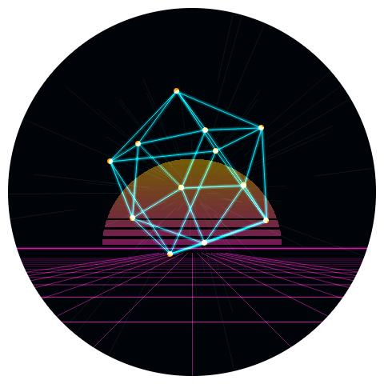
  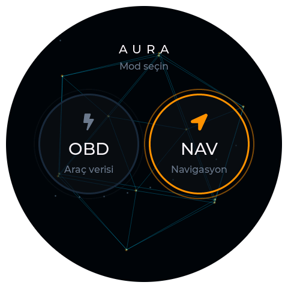
  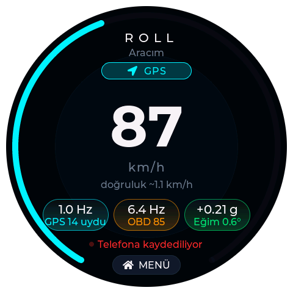
  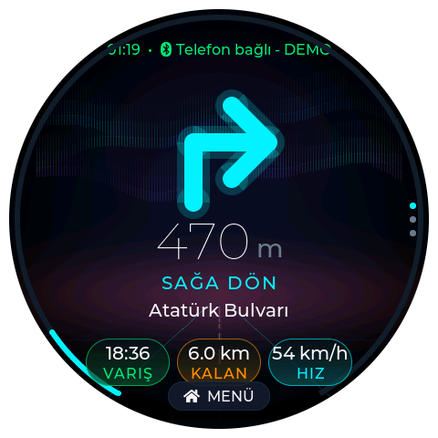
</p>

---

## Promo video

| 🇬🇧 English (1:56) | 🇹🇷 Türkçe (2:04) |
|:---:|:---:|
| <a href="https://github.com/erdemerciyas/ESP32-S3-OBD2/releases/download/v1.2.1/AURA-promo-en.mp4">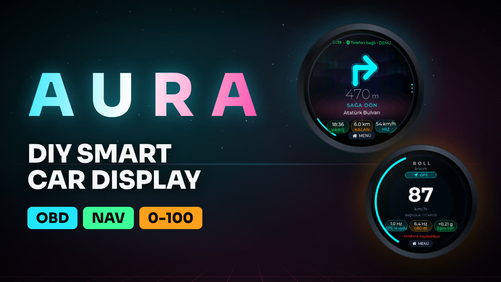</a> | <a href="https://github.com/erdemerciyas/ESP32-S3-OBD2/releases/download/v1.2.1/AURA-promo-tr.mp4">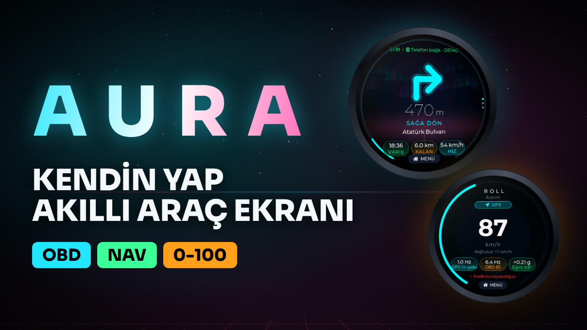</a> |
| [MP4](https://github.com/erdemerciyas/ESP32-S3-OBD2/releases/download/v1.2.1/AURA-promo-en.mp4) · [subtitles](https://github.com/erdemerciyas/ESP32-S3-OBD2/releases/download/v1.2.1/AURA-promo-en.srt) | [MP4](https://github.com/erdemerciyas/ESP32-S3-OBD2/releases/download/v1.2.1/AURA-promo-tr.mp4) · [altyazı](https://github.com/erdemerciyas/ESP32-S3-OBD2/releases/download/v1.2.1/AURA-promo-tr.srt) |

The video is built from the real firmware screenshots with [Remotion](https://www.remotion.dev/); its source is in [`promo/`](promo/).

---

## Table of contents

- [Promo video](#promo-video)
- [Highlights](#highlights)
- [Screenshots](#screenshots)
- [How the device is organised](#how-the-device-is-organised)
- [Touch gestures](#touch-gestures)
- [OBD mode](#obd-mode)
- [NAV mode](#nav-mode)
- [ROLL mode (performance timer)](#roll-mode-performance-timer)
- [AURA Bridge (Android app)](#aura-bridge-android-app)
- [Clock, calendar & 3D screensaver](#clock-calendar--3d-screensaver)
- [Phone ↔ ESP32 protocol](#phone--esp32-protocol)
- [Hardware](#hardware)
- [Getting started](#getting-started)
- [Configuration](#configuration)
- [Architecture](#architecture)
- [Graphics: the fx3d renderer](#graphics-the-fx3d-renderer)
- [Project structure](#project-structure)
- [Developer tools](#developer-tools)
- [Troubleshooting](#troubleshooting)
- [Known limitations](#known-limitations)
- [Türkçe özet](#türkçe-özet)
- [Contributing · License · Author](#contributing)

---

## Highlights

**Car data (OBD-II)**
- **Two adapter types, one firmware:** BLE ELM327 (`FFF0` / `FFE0` GATT profiles) and WiFi ELM327 (TCP `192.168.0.10:35000`). You can switch on-device without a reboot.
- **Universal OBD-II:** the protocol is auto-detected (`ATSP0`) and cached in flash (`ATSPA<n>`). Works with CAN, K-line KWP2000, ISO 9141-2 and J1850.
- **K-line tuning:** prompt gating, a response-count suffix (`010C1`) and slot budgeting keep slow KWP2000 cars at ~6–8 requests/s, with RPM and speed served first.
- **Only supported PIDs are polled.** RPM and speed are interpolated in lock-step at ~60 FPS, and every PID passes an EMA filter with spike rejection.
- **DTC reader / eraser:** stored (`03`), pending (`07`) and freeze-frame (`02`) data, MIL status and readiness. Clearing (`04`) is verified afterwards, a history is kept in flash, and ~190 code descriptions are built in.
- **Inclinometer + G-meter:** QMI8658 gyro/accelerometer fusion with gravity tracking. When OBD speed is available it compensates for acceleration, and gyro bias is learned whenever the car stands still.

**Navigation (phone → display)**
- Maneuver arrow, distance, maneuver text, road name, **ETA · remaining distance · speed**.
- A **proximity ring** that fills as the turn approaches; its colour goes cyan → orange (300 m) → green (100 m).
- **Live 3D background** with an aurora sky and a perspective road. The road flows with your speed and **bends toward the upcoming turn**, starting 400 m before it.
- **Speed-camera, traffic and hazard alerts.** The speed tile turns red when you are above the camera's limit.
- **Map page** (dark OpenStreetMap image rendered by the phone, with the route trail and your position drawn by the ESP; FIT / FOLLOW / zoom) and a **trip page** (distance, duration, average speed, roads taken).

**Performance timing (ROLL)**
- **Speed source picked automatically:** phone GNSS (Doppler speed) when the phone is connected and its fix is good enough, otherwise the ECU speed (PID `0x0D`) via the BLE ELM327. You can force either one in the settings.
- **Phone and OBD adapter at the same time:** one shared NimBLE stack runs as peripheral (phone) and central (ELM327) together.
- **Measured, not guessed:** every sample is timestamped on the ESP when it is taken (µs). The phone's fixes arrive on the ESP's clock through an NTP-style sync over BLE, and the ECU speed carries both the request and the response time.
- **IMU fusion:** QMI8658 longitudinal acceleration at 100 Hz bridges the gaps between 1 Hz phone fixes or ~3–7 Hz K-line samples.
- **Personal settings on the phone:** speed ranges, distances, braking tests, rollout, slope limit, GPS quality thresholds, OBD speed correction, vehicle profile and units. They sync to the ESP and are stored in NVS.
- **Run archive on the phone:** each session is a CSV log. The app shows results and charts, and exports results or raw data as CSV.

**Clock**
- **Date and time come from the phone** (UTC epoch + timezone offset, including DST) on every connection and keep-alive.
- **3D holographic clock screensaver.** Hold the screen for **4 s** on any screen to open it, and tap to return. With the setting on, it also appears after 30 s of inactivity, but **never by itself in NAV mode**.

**Platform**
- **Radio ownership per mode:** OBD and NAV are mutually exclusive, because the ESP32-S3 has a single 2.4 GHz radio. ROLL runs the phone link and a BLE OBD adapter together on one shared NimBLE stack; with a WiFi adapter selected, ROLL uses the phone only. Switching modes stops whatever the new mode doesn't need before starting what it does, and the last mode is restored at boot.
- Animated boot sequence with a buzzer melody, a 3D home menu, and fade transitions between views.
- **Screenshot tour build:** the README images above are real frames captured from the device (see [Developer tools](#developer-tools)).

---

## Screenshots

All images were captured from the running firmware with `lv_snapshot`. The tour build injects demo OBD values and a simulated route; nothing is mocked up.

| Boot | Home (mode select) | 3D clock screensaver |
|:---:|:---:|:---:|
|  |  | 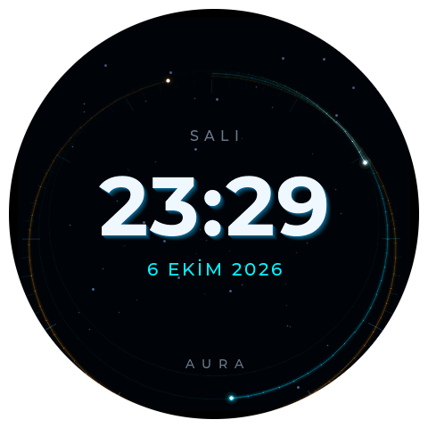 |
| Neon wireframe, synthwave sun, perspective grid | OBD / NAV / ROLL tiles over a rotating icosahedron | Tilted parallax dial: hour, minute, seconds comet |

| NAV — guidance (260 m) | NAV — turn now (80 m) | NAV — idle (no route) |
|:---:|:---:|:---:|
|  | 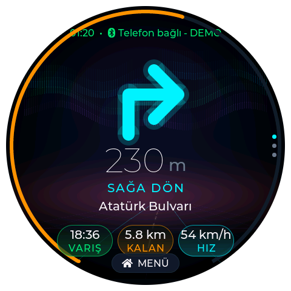 | 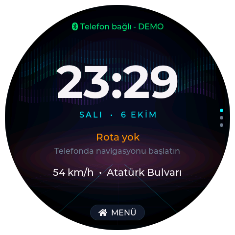 |
| Proximity ring orange, road bending right | Ring green, maneuver imminent | Big clock + date, live speed · current road |

| OBD — Dash | OBD — Live data | OBD — DTC |
|:---:|:---:|:---:|
| 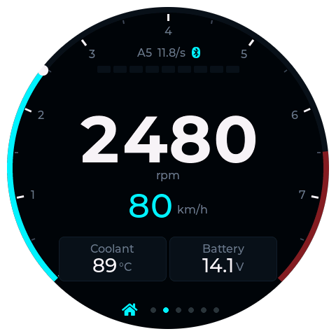 | 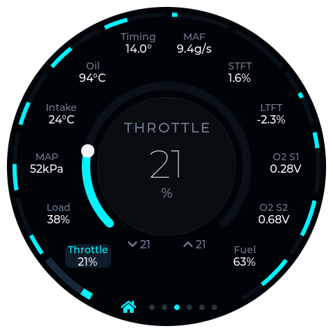 | 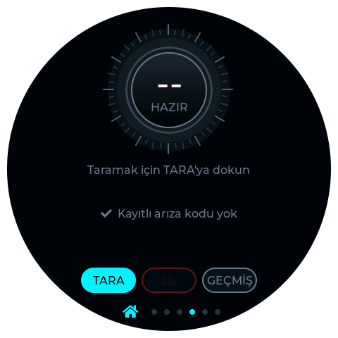 |
| Tachometer, shift lights, coolant · battery | Sensor ring + focus lens with min/max | Scan / clear / history |

| OBD — Inclinometer | OBD — Settings | ROLL — performance timer |
|:---:|:---:|:---:|
| 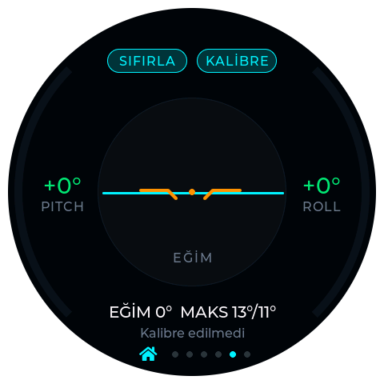 | 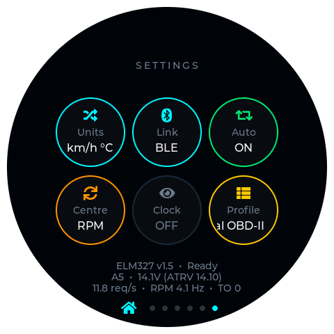 |  |
| Pitch / roll (tap lens: G-meter) | Units · Link · Auto · Centre · **Clock** · Profile | Live speed, source badge, GPS / OBD / IMU status, recording |

---

## How the device is organised

```
                 ┌────────────── Boot animation ──────────────┐
                 ▼                                             │
         ┌───────────────┐   tap OBD    ┌───────────────────────────────────────────┐
         │     HOME      │─────────────►│ OBD: Connect · Dash · Live · DTC · Gyro · │
         │ (mode select) │◄── MENU ─────│      Settings      (swipe left / right)   │
         │               │   tap NAV    ├───────────────────────────────────────────┤
         │               │─────────────►│ NAV: Guidance → Map → Trip   (tap = next) │
         │               │◄── MENU ─────├───────────────────────────────────────────┤
         │               │   tap ROLL   │ ROLL: live speed · sources · recording    │
         └───────────────┘─────────────►│       (phone GNSS + BLE OBD + IMU)        │
                         ◄── MENU ──────└───────────────────────────────────────────┘
                     ▲                          hold 4 s anywhere ▼        ▲ tap
                     └──────────────────────── 3D CLOCK (top layer) ───────┘
```

- **Home** chooses the mode. The choice is stored in NVS and the radio switch happens in the background, so the UI never blocks.
- In **OBD mode** the BLE or WiFi OBD stack runs. In **NAV mode** that stack is shut down and the ESP advertises itself as a BLE peripheral named **`AURA`** for the phone. In **ROLL mode** both run at once: the phone connects to `AURA` while the ESP stays connected to a BLE ELM327.
- The **clock** is an overlay on LVGL's top layer. While it is visible, the screens underneath are not updated, which saves CPU.

---

## Touch gestures

| Where | Gesture | Action |
|-------|---------|--------|
| Anywhere | **Hold still for 4 s** | Open the 3D clock (works in every mode and view) |
| Clock | Tap | Back to the previous NAV / OBD screen. The tap is consumed and does not click through. |
| OBD | Swipe left / right | Next / previous screen |
| OBD | Home icon (dot bar) | Home / mode select |
| NAV | Tap | Next page: Guidance → Map → Trip |
| NAV / ROLL | **MENU** pill | Home / mode select |
| Dash | Double tap | Swap primary value (RPM ↔ speed) |
| Live data | Tap chip / long-press lens | Focus a sensor / reset its min/max |
| Gyro | Tap lens | Inclinometer ↔ G-meter |
| Settings | Tap tile | Toggle / cycle the setting |

The touch controller (CST820) reports a single point, so there are no multi-finger gestures. The 4 s hold uses a 24 px movement tolerance and restarts its timer if your finger slides, so swipes never trigger it.

---

## OBD mode

### Screens

| # | Screen | What it shows |
|---|--------|---------------|
| 1 | **Connect** | Four-stage link ring (SCAN · LINK · ELM · PIDS), radar sweep while busy, BLE / WiFi icon. Tap the centre to re-scan. |
| 2 | **Dash** | 270° tachometer arc with shift lights and redline, big primary value (RPM or speed), secondary value, coolant · battery cards, protocol and request rate, fault badge (tap → DTC). |
| 3 | **Live Data** | Ring of supported sensors (throttle, load, MAP, IAT, oil temp, timing, MAF, STFT/LTFT, O2 S1/S2, fuel level); centre lens with arc, session min/max. |
| 4 | **DTC** | Scan view coloured by state (cyan scanning, green clean, yellow pending, orange stored, red MIL). Code cards → description, likely cause, freeze frame; history; clear dialog. |
| 5 | **Gyro** | Inclinometer (pitch/roll arcs, horizon in the lens) or G-meter (longitudinal/lateral g, 0.5 g / 1 g rings, trail). **SIFIRLA** = zero, **KALİBRE** = 3 s still calibration. |
| 6 | **Settings** | Tiles **Units · Link (BLE/WiFi) · Auto-connect · Centre gauge · Clock · Profile**, plus link diagnostics (adapter, state, protocol, raw voltage + source, req/s, RPM Hz, timeouts). Tap the diagnostics text to open battery-voltage calibration (±0.1 V, stored per adapter type). |

### Supported ELM327 adapters

**Bluetooth Low Energy:** any ELM327 that exposes a serial-like GATT service, either `FFF0` (notify `FFF1`, write `FFF2`) or `FFE0` (`FFE1`/`FFE2`). That covers most "ELM327 v1.5/v2.1 BLE", Vgate iCar Pro BLE, Veepeak BLE and similar adapters. The adapter is found by name (`OBD`, `OBDII`, `ELM`, `VLINK`, …) or by service UUID, and its address is saved so later connections go direct. Classic-Bluetooth (SPP-only) adapters cannot work, because the ESP32-S3 has no BR/EDR radio.

**WiFi:** the clone's open AP (`WiFi_OBDII`, `OBDII`, `V-LINK`, …) is found by scanning for OBD-like names. The firmware connects to the DHCP gateway, falls back to `192.168.0.10:35000`, and uses a static IP if DHCP stays silent. It uses TCP keep-alive and `TCP_NODELAY` with modem sleep off. Recovery from a stale adapter session after the ESP loses power is built in. **One TCP client only:** close phone OBD apps first.

### PIDs

| PID | Value | Shown on |
|-----|-------|----------|
| `0C` / `0D` | RPM / speed | Dash (also IMU speed compensation) |
| `05` / `5C` | Coolant / oil temperature | Dash, Live; coolant over-temperature buzzer |
| `42` or `ATRV` | Module / battery voltage | Dash, Settings (raw + source, calibratable) |
| `11` `04` `0B` `0F` `0E` `10` | Throttle, load, MAP, IAT, timing, MAF | Live |
| `06` `07` `14` `15` `2F` | Fuel trims, O2 S1/S2, fuel level | Live |
| `01` `03` `07` `02` `04` | MIL/readiness, DTCs, pending, freeze frame, clear | DTC |

RPM and speed get most of the bus time; slow values get fixed slots. Values older than 3 s are shown as `--`.

---

## NAV mode

When NAV is selected, the ESP32 starts NimBLE as a **peripheral** advertising `AURA`. The AURA Bridge app connects to it and streams guidance.

### Guidance page

| Element | Details |
|---------|---------|
| Status line | `HH:MM • Telefon bağlı` (phone connected), `Veri eski` (stale > 5 s), or an alert pill in its place |
| Maneuver arrow | Vector arrows for straight, left/right, slight left/right, U-turn, roundabout and arrival, with a neon glow. Dimmed when data is stale. |
| Distance + text | `260 m` / `1.2 km` and `SAĞA DÖN` ("turn right"), etc. |
| Road | Next road (or current road), scrolling if long |
| Pills | **VARIŞ** (ETA, green) · **KALAN** (remaining, orange) · **HIZ** (speed, cyan; turns red above a camera limit) |
| Proximity ring | 300° arc that fills from the first distance seen for this maneuver to 0; cyan > 300 m, orange 100–300 m, green < 100 m |
| Background | fx3d scene at ~15 fps: warm horizon glow, aurora curtains, perspective road whose centre dashes flow with GPS speed and which **curves toward the turn** within 400 m. It dims and stops when data is stale. |
| Alerts | `RADAR 350 m 50 km/h` (red), traffic (yellow), hazard (orange), info; they expire after 8 s without refresh |

**Idle view** (no phone or no route): a large clock, `SALI • 6 EKİM`-style date, the status message, and live phone speed with the current road.

### Map page

The phone renders a **dark OpenStreetMap JPEG** (460×460, Web Mercator) and sends it over a separate BLE characteristic with acknowledged writes. The ESP decodes it in its own task (`esp_jpeg`, double-buffered) and draws the **recorded trail and your position** with the same projection. There are two modes: **FIT** (the whole trip fits, zoom shrinks as the route grows) and **FOLLOW** (vehicle-centred). The **+ / − / ALL** buttons send a `mapreq` back to the phone.

### Trip page

Distance driven, duration, average speed, and the most recent roads (newest first), recorded on the ESP from `start` to `stop`. A BLE reconnect does not reset a running trip.

---

## ROLL mode (performance timer)

ROLL measures how fast the car gets from one speed to another (0-100, 60-120, 100-200 km/h…), how long distance runs take (60 ft, 201 m, 402 m…), braking, and the road slope during the run. The aim is **real, verifiable numbers**, so every design choice starts from where timing errors come from.

> **Status (v1.2.0, phase F0 — measurement chain):** live speed, source selection, synchronized raw logging, personal settings, and run analysis in the app and on a PC are in place. The on-device run engine (arming, live run timer, timeslip on the display) is the next phase and will be tuned with real F0 logs.

### Where the speed comes from

| Source | When | Strengths | Limits |
|--------|------|-----------|--------|
| **Phone GNSS** (default) | Phone connected, fix fresh (< 2 s), speed accuracy and satellite count within your thresholds | Doppler speed (not position differences), independent of tyres and wheelspin, gives altitude for slope | Most phones deliver 1 Hz |
| **ECU speed** (PID `0x0D`) via BLE ELM327 | No usable phone fix, or forced in settings | Works without a phone; speed-only polling roughly doubles the K-line rate | 1 km/h steps, 255 km/h cap, ECU filtering lag, speedometer scale error, nothing below ~3 km/h |
| **IMU** (QMI8658, 100 Hz) | Always | Fills in between samples, pins the launch moment, measures pitch | Needs a mount calibration; drifts without anchors |

Timing error is roughly **speed error ÷ acceleration**, so a slow car is the hardest case. For a 2005 Kalos (≈1.3 m/s² at 100 km/h), 1 km/h of speed error costs ≈0.2 s on 0-100, and each 0.1 % of road grade costs ≈0.055 s. Expected 0-100 accuracy for such a car:

| Setup | Accuracy |
|-------|----------|
| OBD only | ±0.2–0.5 s |
| Phone GNSS only (1 Hz) | ±0.2–0.5 s |
| **Phone GNSS + IMU + post-run smoothing** | **≈ ±0.1 s** |
| External 10–25 Hz GNSS + IMU (possible later) | ±0.03–0.05 s |

### On the display

- A 300° speed arc whose colour shows the active source (cyan = GPS, orange = OBD).
- A large speed readout in your unit, with the vehicle name and the accuracy of the current source.
- Three status pills: **GPS** (fix rate, satellites), **OBD** (sample rate, raw ECU speed) and **IMU** (longitudinal g, pitch).
- A blinking dot while telemetry is being recorded on the phone.

### Settings (in the AURA Bridge app)

**ROLL ayarları** on the phone. Every change is saved instantly and synced to the ESP (`rcfg`, stored in NVS `roll/cfg`).

| Group | Options |
|-------|---------|
| Measurement | Source: Auto (GPS first) / GPS only / OBD only · Unit: km/h / mph |
| Targets | Up to 10 speed ranges (presets 0-50 … 200-300 plus custom), 6 distances (60 ft, 100 m, 201 m, 402 m, 1000 m, ½ mile, custom), 3 braking tests (100-0, 60-0, 200-0, custom) |
| Start | Automatic (ready when stopped) or countdown tree (Pro 0.4 s / Sportsman 0.5 s) · 1-ft rollout |
| Validation | Slope limit (off / 0.5–2 %) · show slope-corrected time · minimum GPS speed accuracy · minimum satellites |
| OBD | Speed correction: automatic (learned from GPS) or manual ±10 % |
| Vehicle | Name, weight, drive (FWD / RWD / AWD) |
| Sound & display | Beep · result hold time |
| Logging | Raw telemetry on/off · auto-delete after 30 / 90 days |

### Logs, results and CSV export

While the ESP is in ROLL mode, the phone records a CSV log containing:
- GNSS fixes on the ESP clock (speed, accuracy, altitude, satellites);
- IMU samples at 100 Hz;
- every ECU speed sample with its request and response time;
- the clock-sync samples.

In **ROLL kayıtları**, each log row shows a short summary (e.g. *2 koşu · en iyi 0-100 15,2 s*). Tap a log to open the viewer:

- **Best results:** your targets as tiles, with trap speed, braking distance and slope-corrected time where they apply.
- **Chart:** a speed–time chart with the fused curve, GPS fixes, OBD samples, launch markers and run bands, plus a longitudinal-g strip. Tap or drag for a cursor readout; pinch to zoom.
- **Runs:** one card per run. For each target you get the best time, GPS-only and OBD times, slope from GPS altitude and from the IMU, and a validity badge (Doğrulandı / Eğim aşıldı / GPS zayıf).
- **Source quality:** fix rate, speed accuracy, satellites, gaps, IMU rate, OBD rate and latency, sync RTT, and the OBD scale k and lag τ measured against GPS.
- **Export:** results as CSV (one row per run × target) or the raw log, to `Download/AURA` or through the share sheet.

For deeper analysis on a PC:

```bash
python scripts/roll_analyze.py roll_20261007_101500.csv --ranges 0-100,60-120 --plot
```

It prints source statistics, the OBD scale error and lag against GPS, and every run with GPS, fused, raw OBD and calibrated OBD times plus slope, and it saves a chart. The app's analysis (`RollAnalysis.kt`) gives the same numbers as this script. On a synthetic run with a known answer (true 0-100 = 15.17 s), the fused result was 15.22 s.

---

## AURA Bridge (Android app)

Source in [`android-bridge/`](android-bridge/) (Kotlin, `minSdk 26`, `targetSdk 34`, package `com.obdnav.bridge`). APKs are built locally (`dist/`) or published on Releases.

| Feature | How |
|---------|-----|
| Guidance source | `NotificationListenerService` reads navigation notifications from **Yandex Navigator** (`ru.yandex.yandexnavi`), **Yandex Maps**, **Google Maps** and **Waze**. Yandex uses custom RemoteViews, so the view is inflated and every TextView is read. Parsing is heuristic, and a raw dump is shown in the app for tuning. |
| BLE link | Scans for the `AURA` service UUID, MTU 247, high connection priority, write queue, auto-reconnect, `ping` every 2 s |
| Time sync | `hello` and every `ping` carry `ts` (UTC epoch s) and `tz` (local offset in minutes, DST-aware) |
| Speed cameras | Independent of the nav app: OSM `highway=speed_camera` nodes via the Overpass API (±0.3° around you, disk-cached). The nearest camera within 600 m ahead triggers an `alert` with its limit. |
| GPS | Foreground location service sends `loc` (lat/lon/speed/heading) |
| Maps | OSM tiles (cached, identifying User-Agent) composed and colour-filtered into a dark 460 px JPEG; FIT / FOLLOW driven by the ESP |
| ROLL | Starts by itself when the ESP reports ROLL mode: fastest `GPS_PROVIDER` updates plus satellites in use, `gnss` messages stamped on the ESP clock, a 1 s clock-sync ping, telemetry recording to CSV. Also **ROLL ayarları** (settings) and **ROLL kayıtları** (log viewer, CSV export). |
| Trips | Every navigation session is saved as JSON. The trip list/viewer renders a **shareable image**: dark map, route (green start, red end), yellow alert markers and a summary panel, saved to `Pictures/AURA`. |

**Setup on the phone**
1. Install the APK and open it. Grant Bluetooth, location and notifications.
2. Enable **Notification access** for AURA. On Android 13+, sideloaded apps first need **App info → ⋮ → Allow restricted settings**.
3. In Yandex Navigator, enable **background navigation** so the guidance notification exists.
4. On the display, choose **NAV**. The app connects automatically and the display shows `Telefon bağlı`.

---

## Clock, calendar & 3D screensaver

- **Time source:** the phone's `hello` / `ping` (`ts`, `tz`). Drifts under 2 s are ignored, so the seconds never jump. The timezone is stored in NVS (`clock/tz`, default UTC+3). At boot the firmware also probes for a **PCF85063 RTC** at I²C `0x51`. The ESP32-S3-Touch-LCD-2.1 used here has none, so until the phone connects after a power loss the clock shows `--:--` / `SAAT AYARLANMADI` ("clock not set").
- **Opening it:** hold the screen still for **4 s** on any screen, in any mode. **Settings → Clock** (`clock/saver`) additionally enables auto-start after **30 s** without touch, in OBD mode and on Home only. **In NAV mode the clock never appears on its own.** A new NAV alert (camera, hazard…) closes it immediately.
- **Closing it:** any tap. The view underneath is unchanged and the release does not click anything.
- **Design:** a 440 px fx3d canvas at 20 fps behind LVGL labels:
  - a dial tilted back ~25° that slowly sways, which creates parallax between depth layers: minute ticks at the back, the **orange hour arc**, the **cyan minute arc**, and a **seconds comet** with a fading tail at the front;
  - depth shading (near = bright, far = dim) and glowing beads at the arc heads;
  - a starfield drifting toward the camera;
  - six-layer **extruded** `HH:MM` digits (94 px bold), weekday above and `6 EKİM 2026` below;
  - a 450 ms fade-in.

---

## Phone ↔ ESP32 protocol

Transport: BLE GATT, the ESP is the peripheral named `AURA`.

| Characteristic | UUID | Direction | Use |
|----------------|------|-----------|-----|
| Service | `7c6a0001-2f4b-4b8e-9d3a-5e1f0c2a9b10` | | |
| RX | `7c6a0002-…` | phone → ESP, write / write-no-rsp | JSON messages (one message per write) |
| TX | `7c6a0003-…` | ESP → phone, notify | JSON replies |
| MAP | `7c6a0004-…` | phone → ESP, acknowledged write | JPEG chunks `[id:1][offset:3 LE][bytes]` |
| TEL | `7c6a0005-…` | ESP → phone, notify | ROLL telemetry, binary LE `[type][n][records]`: IMU 14 B (`u32 t_us, i16 ax ay az mm/s², i16 yaw 0.01°/s, i16 pitch 0.01°`), OBD 9 B (`u32 t_tx_us, u32 t_rx_us, u8 km/h`) |

Messages (protocol v1, JSON, short keys so they fit a single write). In an `upd`, only the fields present are applied, so a source that doesn't know a field keeps the value already on screen.

```jsonc
{"t":"hello","v":1,"src":"android","ts":1791316800,"tz":180}   // → {"t":"status","v":1,"dev":"AURA","mode":"roll"}
{"t":"ping","seq":7,"ts":1791316800,"tz":180,"m":123456789012} // → {"t":"pong","seq":7,"m":123456789012,"e":987654321}
{"t":"start","dst":"Ulus"}                                        // opens a trip
{"t":"upd","seq":42,"m":"R","md":800,"rd":12400,"eta":1122,"spd":54,"hdg":90,
 "road":"Ankara Cd.","next":"Atatürk Blv.","dst":"Ulus"}
{"t":"stop"}                                                      // closes the trip
{"t":"loc","lat":39.92,"lon":32.85,"spd":54,"hdg":90}
{"t":"alert","k":"cam","d":350,"lim":50,"txt":"Radar"}            // k: cam traffic hazard info none
{"t":"map","id":7,"len":34567,"w":460,"h":460,"clat":39.92,"clon":32.85,"z":15}
// ROLL
{"t":"gnss","e":987654321,"v":27.53,"sa":0.31,"alt":912.4,"va":3.0,"ha":3.5,"hdg":91.2,"sat":14,"lat":39.92,"lon":32.85}
{"t":"rcfg","v":1,"src":"auto","unit":"kmh","spd":"0-100,60-120,100-200","dst":"18.288,201.168,402.336",
 "brk":"100-0","start":"auto","tree":0.4,"ro":0,"slope":1.0,"slc":1,"gacc":1.0,"sats":6,"obdk":0,
 "mass":1100,"drive":"fwd","name":"Kalos","beep":1,"hold":10}            // → {"t":"rcfgack","ok":true}
// ESP → phone:  {"t":"mapack","id":7,"ok":true,"why":""}   {"t":"mapreq","mode":"fit|follow","z":15}
//               status is also sent unsolicited whenever the ESP changes mode
```

- `m`: `S` straight, `L`/`R` left/right, `SL`/`SR` slight, `U` U-turn, `RB` roundabout, `A` arrival.
- `eta` is minutes after midnight (18:42 → `1122`). Distances are in metres.
- **Clock sync (ROLL):** `m` in `ping` is the phone's monotonic clock in µs. It is a number here; in `upd`, `m` is the maneuver text. The phone keeps the lowest-RTT samples and computes `offset = e − (m + arrival)/2`, so `gnss.e` is the fix time on the ESP clock. `e` is left out until the sync is valid; the ESP then uses the arrival time.
- `gnss`: `v` Doppler speed m/s, `sa` speed accuracy m/s (1σ), `alt` MSL altitude, `va`/`ha` accuracies, `sat` satellites used in the fix; `-1` = unknown.

The codec (`nav_codec_json.c`) and transport (`nav_transport_ble.c`) sit behind small interfaces, so a binary codec or another radio can be swapped in without touching `nav_service.c`.

---

## Hardware

| Component | Details |
|-----------|---------|
| Board | [Waveshare ESP32-S3-Touch-LCD-2.1](https://www.waveshare.com/esp32-s3-touch-lcd-2.1.htm) |
| MCU | ESP32-S3, 2× Xtensa LX7 @ 240 MHz, WiFi 2.4 GHz + BLE 5 |
| Memory | 16 MB flash, 8 MB octal PSRAM @ 80 MHz |
| Display | 2.1" 480×480 round IPS (≈460 px visible), ST7701, RGB565 parallel |
| Touch | CST820 capacitive, single point (I²C `0x15`) |
| IMU | QMI8658 6-axis (±8 g, ±512 dps, LPF ~33 Hz) |
| Buzzer | TCA9554 IO expander pin 7 (EXIO8) |
| OBD adapter | ELM327 clone, BLE or WiFi (OBD mode); BLE for OBD in ROLL |
| Phone | Android 8.0+ with BLE and GNSS (NAV and ROLL modes) |
| Power | USB-C 5 V (car USB socket or 12 V → 5 V converter) |

Shared I²C bus on GPIO 19 (SDA) / 20 (SCL): touch `0x15`, QMI8658 `0x6A`, TCA9554 `0x27`. The USB-JTAG port carries the app console; the CH343 UART port can flash but shows only the ROM banner.

---

## Getting started

### 1. Firmware

**Prebuilt:** download the merged image from [Releases](https://github.com/erdemerciyas/ESP32-S3-OBD2/releases) and write it at `0x0`:

```bash
pip install esptool
esptool.py --chip esp32s3 -p COM3 write_flash 0x0 <merged-image>.bin
```

> Releases from `v1.2.0` on ship the merged firmware image and the AURA Bridge APK together. `v1.0.0` predates NAV, clock, ROLL and AURA.

**From source** (ESP-IDF **v5.3.5**):

```bash
git clone https://github.com/erdemerciyas/ESP32-S3-OBD2.git
cd ESP32-S3-OBD2
. C:\Espressif\frameworks\esp-idf-v5.3.5\export.ps1   # Linux/macOS: . $IDF_PATH/export.sh
idf.py build
idf.py -p COM3 flash monitor
```

Managed components (`esp32_display_panel`, `lvgl`, `esp_jpeg`) are fetched on the first build. The current image is ≈1.8 MB in a 3 MB factory partition (~40% free).

> **Windows:** run `idf.py` from PowerShell or `cmd`, not Git Bash/MSYS. If `export.ps1` cannot find Python, put `C:\Espressif\python_env\idf5.3_py3.11_env\Scripts` on `PATH` first.

### 2. Android bridge (NAV and ROLL modes)

Requirements: JDK 17, Android SDK (platform 34), Gradle 8.9.

```bash
cd android-bridge
export JAVA_HOME=/path/to/jdk17 ANDROID_HOME=/path/to/android-sdk
gradle assembleRelease            # → app/build/outputs/apk/release/app-release.apk
```

Then follow the [phone setup](#aura-bridge-android-app).

### 3. In the car

1. **OBD:** plug in the ELM327 and turn the ignition on. On the display choose **OBD**. For a WiFi adapter, set **Settings → Link** to **WiFi**.
2. **NAV:** choose **NAV** and start navigation on the phone.
3. **ROLL:** start the bridge on the phone (it needs location), keep the BLE ELM327 plugged in, and choose **ROLL**. The phone connects, the clock syncs and recording starts by itself. Calibrate the IMU once on level ground (OBD → Gyro → KALİBRE) so that slope and acceleration are measured correctly.
4. **Clock:** hold the screen for 4 s, or enable **Settings → Clock** for the idle screensaver outside NAV.

---

## Configuration

### Runtime (on the device)

| Setting | Where | Stored in NVS |
|---------|-------|---------------|
| Mode (OBD / NAV / ROLL) | Home | `app/mode` |
| ROLL settings (targets, source, thresholds, vehicle) | phone → **ROLL ayarları** | `roll/cfg` |
| Link (BLE / WiFi) | Settings → Link | `obd_link/type` |
| Battery voltage calibration (per link) | Settings → tap the diagnostics text | `obd_volt` |
| Vehicle profile | Settings → Profile | `obd_profiles` |
| Clock screensaver | Settings → Clock | `clock/saver` |
| Timezone | from the phone | `clock/tz` |
| IMU calibration / mount | Gyro → KALİBRE | `imu/cfg2` |
| Saved BLE adapter, detected protocol, DTC history | automatic | `obd_ble`, `obd_elm`, `obd_dtc` |
| Units, auto-connect, centre gauge | Settings tiles | not persisted (defaults at boot) |

### Build time (`idf.py menuconfig` → *OBD2 Dashboard Configurations*)

| Option | Default | Meaning |
|--------|---------|---------|
| `OBD_LINK_DEFAULT_WIFI` | `n` | Transport on first boot |
| `OBD_WIFI_SSID` / `_PASSWORD` | empty | Pin the adapter AP; empty = scan for OBD-like names |
| `OBD_WIFI_HOST` / `_PORT` | empty / `35000` | Pin the adapter address |
| `NAV_MOCK` | `n` | Feed NAV with a simulated Ankara route (no phone needed) |
| `UI_SHOT_TOUR` / `UI_SHOT_EPOCH` | `n` / `0` | Screenshot tour build (developer only) |
| `LVGL_PORT_AVOID_TEARING_MODE` | `3` | Double buffer + direct mode |

Notable `sdkconfig.defaults` choices: octal PSRAM with XIP; NimBLE with PSRAM allocation; WiFi/LWIP buffers in PSRAM; `LV_DISP_DEF_REFR_PERIOD=16` (~60 FPS); `LV_USE_SNAPSHOT`.

---

## Architecture

```
            ┌───────────── OBD mode ─────────────┐        ┌──────────── NAV mode ────────────┐
 ELM327 BLE ─► ble_obd.c ─┐                       │ Phone ─► nav_transport_ble.c (peripheral)│
 ELM327 WiFi► wifi_obd.c ─┴► obd_link.c           │  (AURA     │ RX / MAP / TX                │
                              │                   │  Bridge)   ▼                              │
                         elm327.c  (1 cmd in flight, prompt gating)   nav_codec_json.c       │
                              │                   │            ▼                              │
                  obd_pids.c · obd_dtc.c          │       nav_service.c ─► nav_state (rev++) │
                              │                   │            │      ├► nav_track (trip)     │
                       vehicle_data (snapshot)    │            │      ├► nav_map (JPEG task)  │
                              │                   │            │      └► clock (time sync)    │
            └─────────────────┼───────────────────┘        └───┼──────────────────────────────┘
                              ▼                                ▼
            imu_data.c ─►  ui/*  — LVGL, one 16 ms update timer, views: home · OBD tabs · NAV pages
                              └── top layer: 3D clock (screen_clock.c) · view-transition veil
 app_mode.c — owns the radios per mode (OBD · NAV · ROLL = phone + BLE OBD), persists the mode
 ble_host.c — one shared NimBLE stack; ble_obd (central) and nav_transport_ble (peripheral) are clients

            ┌──────────────────────────── ROLL mode ─────────────────────────────┐
 Phone gnss ─► nav_service ─┐
 ECU 0x0D ───► obd_pids ────┼─► roll_feed.c (µs stamps, source pick, IMU bridge) ─► screen_roll.c
 QMI8658 ────► imu_data ────┘        └─► TEL notify (IMU + OBD batches) ─► phone CSV log
 rcfg ───────► roll_cfg.c (NVS roll/cfg)
            └─────────────────────────────────────────────────────────────────────┘
```

- OBD and NAV tasks run on core 0; LVGL and all rendering run on core 1.
- The UI reads **snapshots** (`vehicle_data_snapshot`, `nav_state_snapshot`) and redraws only when a revision changes or text actually differs, so scrolling labels keep animating smoothly.
- `nav_service` keeps an open trip across BLE drops; `start` resets the track only when no trip is open.

---

## Graphics: the fx3d renderer

`main/ui/fx3d.c` is a tiny software renderer that draws into RGB565 PSRAM buffers wrapped as LVGL canvases:

- **additive, anti-aliased lines** (Xiaolin Wu), so overlapping strokes glow;
- **neon glow lines** (dim halo + bright core) and soft dots;
- 3D rotation, perspective projection and an icosahedron mesh.

| Scene | File | Canvas | Rate |
|-------|------|--------|------|
| Boot: warp stars, synthwave sun, grid, rotating icosahedron | `screen_splash.c` | 460 px | 30 fps |
| Home: slow wireframe + orbit ring | `screen_home.c` | 360 px | 15 fps |
| NAV background: horizon glow, aurora, bending road | `screen_nav_bg.c` | 440 px (+ static base) | 15 fps |
| Clock: parallax dial, comet, starfield | `screen_clock.c` | 440 px | 20 fps |

Each scene renders only while its view is visible. The NAV background builds its gradient once and copies it each frame. LVGL text and widgets are layered on top.

---

## Project structure

```
├── main/
│   ├── main.c                 # boot: NVS, display, buzzer, clock, IMU, UI, OBD, mode
│   ├── app_mode.c/h           # OBD / NAV / ROLL radio ownership, persisted mode
│   ├── ble_host.c/h           # shared NimBLE stack (central + peripheral clients)
│   ├── Kconfig.projbuild      # display, OBD link, NAV mock, developer options
│   ├── bsp/                   # panel, LVGL port (touch IRQ-gated reads), buzzer
│   ├── obd/                   # obd_link, ble_obd, wifi_obd, elm327, obd_pids, obd_dtc
│   ├── nav/                   # protocol, JSON codec, BLE transport, service, state,
│   │                          # trip track, map JPEG pipeline, mock route
│   ├── data/                  # vehicle data, profiles, DTC DB, log, clock (time/TZ/RTC)
│   ├── imu/                   # QMI8658 driver, fusion, calibration
│   ├── roll/                  # ROLL: roll_feed (sources, timestamps, telemetry), roll_cfg
│   └── ui/                    # theme, fx3d, splash, home, OBD screens, NAV pages,
│                              # NAV background, clock screensaver, screenshot tour, fonts
├── android-bridge/            # AURA Bridge (Kotlin)
├── version.txt                # single version source (firmware + Android)
├── .githooks/                 # pre-commit: version bump required · post-commit: tag
├── scripts/
│   ├── bump_version.sh        # patch / minor / major
│   ├── capture_screens.py     # tour frames → docs/screenshots/*.png
│   ├── nav_bridge_sim.py      # PC BLE phone emulator (bleak)
│   ├── roll_bridge_sim.py     # PC BLE emulator for ROLL: clock sync, gnss, TEL counters
│   ├── roll_analyze.py        # ROLL log analysis: sources, OBD k/τ, runs, slope, plot
│   └── verify_round_lcd_layout.py
├── simulator/                 # LVGL PC simulator (Visual Studio)
├── promo/                     # promo video source (Remotion, EN + TR)
├── docs/                      # website, screenshots, dev rules, design notes
├── CHANGELOG.md               # dated history (Turkish), status, open items
├── partitions.csv             # NVS · PHY · 3 MB factory app
└── sdkconfig.defaults
```

---

## Developer tools

### Regenerating the README screenshots

The **screenshot tour** is a separate build (`build_shots/`) that never ships. It sets the clock, injects demo OBD data, plays the mock route, walks every view and prints each `lv_snapshot` frame as numbered base64 lines. Every frame is sent twice so lines dropped by the USB console can be refilled from the other copy.

```powershell
# 1. tour config = your sdkconfig + overrides
mkdir build_shots; copy sdkconfig build_shots\sdkconfig
Add-Content build_shots\sdkconfig "CONFIG_UI_SHOT_TOUR=y`nCONFIG_NAV_MOCK=y`nCONFIG_UI_SHOT_EPOCH=$([DateTimeOffset]::UtcNow.ToUnixTimeSeconds())"

# 2. build + flash the tour, capture (≈2–3 min), PNGs get a round alpha mask
idf.py -B build_shots -D SDKCONFIG=build_shots/sdkconfig -p COM3 flash
python scripts/capture_screens.py --port COM3 --out docs/screenshots

# 3. put the normal firmware back
idf.py -p COM3 flash
```

`capture_screens.py` needs only `pyserial`, which ships in the ESP-IDF Python environment, and writes PNGs without PIL.

### Versioning (required for every commit)

Every commit carries a new version. `version.txt` is the single source of truth. ESP-IDF uses it as the app version, which is shown in the boot log and at the bottom of the Home screen. The Android bridge derives `versionName` and `versionCode` from it (`major·10000 + minor·100 + patch`).

```bash
git config core.hooksPath .githooks        # once per clone
scripts/bump_version.sh patch              # or minor / major
# add "## vX.Y.Z — date — title" to CHANGELOG.md, then commit as usual
git push --follow-tags
```

`.githooks/pre-commit` rejects a commit if `version.txt` did not increase or `CHANGELOG.md` has no entry for the new version. `.githooks/post-commit` creates the annotated tag `vX.Y.Z`. Use semantic versioning:

- **patch:** fixes and small changes;
- **minor:** new features;
- **major:** incompatible changes, such as the BLE protocol or NVS layout.

### Other tools

- **`NAV_MOCK`**: an 8-step simulated route (all maneuver types, arrival hold, loop) to develop the NAV UI without a phone.
- **`scripts/nav_bridge_sim.py`**: emulates the phone from a PC over BLE (`pip install bleak`) and plays protocol v1.
- **`scripts/roll_bridge_sim.py`**: emulates the phone in ROLL mode (clock sync, a synthetic 0→100 GNSS ramp) and counts the TEL telemetry.
- **`scripts/roll_analyze.py`**: analyses a ROLL log exported from the phone (see [ROLL mode](#logs-results-and-csv-export)).
- **PC simulator**: `simulator/` compiles `main/ui/` for Windows (Visual Studio 2022, x64); see [`simulator/README.md`](simulator/README.md).
- **Logs**: the USB-JTAG console at 115200 prints the OBD link summary every 5 s, plus NAV hello/route/map events and clock sync.

---

## Troubleshooting

| Symptom | What to check |
|---------|---------------|
| OBD stuck on **SCAN** (BLE) | Ignition on? Is a phone already connected to the adapter? Unusual name or UUID? |
| WiFi adapter not found / refused | **Settings → Link = WiFi**; AP visible on a phone? Close other OBD apps (single TCP slot); pin SSID/host in menuconfig. |
| Connected but no data | Ignition on (engine running is best); check the protocol line in Settings; raise the profile's ELM timeout for very slow ECUs. |
| Voltage off by a few tenths | Settings shows the raw value and source (`ATRV`/`0142`); tap it to calibrate. |
| NAV: `Telefon bağlı değil` (phone not connected) | Is NAV selected on the display? Bluetooth and location on in the app? Only one phone can connect at a time. |
| NAV: connected but no guidance | Notification access granted (on Android 13+ allow restricted settings first)? Yandex background navigation on? The app's log shows the raw notification dump. |
| No map on the map page | The phone needs internet for OSM tiles; the app shows map send / ack status. |
| ROLL: badge says `SİNYAL YOK` (no signal) | Is the bridge running on the phone with location on? GPS needs open sky. For OBD fallback the adapter must be BLE (WiFi isn't used in ROLL). Also check the GPS accuracy / satellite thresholds in ROLL settings. |
| ROLL: recording dot not blinking | The phone must be connected in ROLL mode. Update the app if it predates v1.2.0 (no telemetry support). |
| Clock shows `--:--` | No RTC on this board: connect the phone once in NAV mode after a power loss. |
| Clock never appears by itself | By design in NAV mode. Elsewhere, enable **Settings → Clock** and leave the screen untouched for 30 s. |
| Display black / LVGL OOM | `CONFIG_BOARD_WAVESHARE_ESP32_S3_TOUCH_LCD_2_1=y`, PSRAM detected at boot, `CONFIG_LV_MEM_CUSTOM=y`. |

---

## Known limitations

- **No RTC on the board:** wall time is lost on power loss until the phone reconnects in NAV mode. A PCF85063 at `0x51` would be used automatically if fitted.
- **One radio:** OBD and NAV cannot run at the same time; switching takes a few seconds. ROLL shares BLE between the phone and a BLE adapter (not WiFi).
- **ROLL accuracy is bounded by the sources:** most phones give 1 Hz GNSS, and PID `0x0D` has 1 km/h steps and caps at 255 km/h. IMU fusion recovers most of this (≈ ±0.1 s on 0-100); Dragy-class ±0.05 s would need a 10–25 Hz external GNSS. The on-device run engine is still in progress (F0 delivers the measurement chain and the analysis).
- **Single-touch panel:** no pinch or multi-finger gestures, which is why the clock uses a 4 s hold.
- **Notification parsing** depends on undocumented layouts of the navigation apps and may need rule updates after app updates.
- **OSM usage:** tiles and Overpass are used under their fair-use policies with caching; heavy use needs your own tile server.
- **Localization:** NAV, clock and DTC texts are Turkish, while OBD gauges and Settings are English.

### Localization

UI strings live next to each screen in `main/ui/*.c`, and fonts include the Turkish glyphs (`lv_font_tr_16/20`: ÇÖÜçöüĞğİıŞş). DTC descriptions are in `main/data/dtc_db.c`. Contributions of other languages are welcome.

---

## Türkçe özet

**AURA**, Waveshare ESP32-S3-Touch-LCD-2.1 yuvarlak ekranı araç içi akıllı ekrana çevirir:

- **OBD modu:** ELM327 (BLE / WiFi) ile devir, hız, sıcaklıklar, voltaj, canlı sensörler, **arıza kodu okuma/silme**, eğim ölçer / G-metre.
- **NAV modu:** **AURA Köprü** Android uygulaması Yandex Navigasyon / Yandex Haritalar / Google Haritalar / Waze bildirimlerinden rehberliği BLE ile gönderir. Ekranda ok, mesafe, yaklaşma halkası, dönüşe doğru kıvrılan canlı 3D yol, radar uyarısı (limit aşılırsa hız kırmızı), karanlık harita ve sürüş özeti görünür.
- **ROLL modu (v1.2.0):** Dragy benzeri performans ölçümü: 0-100, 60-200, 80-250, kendi aralıkların, mesafe koşuları ve frenleme. Telefon bağlıysa hız **telefon GPS'inden** (Doppler), değilse **BLE ELM327 üzerinden araç ECU'sundan** alınır; aradaki boşlukları **IMU 100 Hz** doldurur. Tüm örnekler ESP saatine µs hassasiyetle damgalanır. Kişisel ayarlar (hedefler, kaynak, eğim sınırı, GPS eşikleri, OBD düzeltmesi, araç profili) telefondaki **ROLL ayarları** ekranındadır. Kayıtlar telefonda tutulur; **ROLL kayıtları** ekranında sonuçlar, grafik ve koşu ayrıntıları görülür, sonuçlar veya ham kayıt CSV olarak dışa aktarılır.
- **Saat:** tarih ve saat telefondan ayarlanır. **Her ekranda 4 sn basılı tutunca** 3D holografik saat açılır, dokununca geri dönülür. Ayarlar → **Clock** açıksa OBD / ana menüde 30 sn dokunulmazsa kendiliğinden gelir; **NAV modunda asla kendiliğinden gelmez**.
- **Tanıtım videosu:** Türkçe ve İngilizce videolar [v1.2.1 sürümünde](https://github.com/erdemerciyas/ESP32-S3-OBD2/releases/tag/v1.2.1); kaynağı `promo/` klasöründe (Remotion).
- Kurulum: ESP-IDF 5.3.5 ile `idf.py build` → `idf.py -p COM3 flash`. Android uygulaması için `android-bridge` içinde `gradle assembleRelease`. Ayrıntılı geçmiş: [`CHANGELOG.md`](CHANGELOG.md).

---

## Contributing

Issues and pull requests are welcome, especially reports of which ELM327 adapters and cars work, and samples of navigation notifications (the app's raw dump) from other apps or regions. Keep connection-code changes small and test them on real hardware; see [`docs/GELISTIRME_KURALLARI.md`](docs/GELISTIRME_KURALLARI.md).

## License

[MIT](LICENSE) © 2026 Erdem Erciyas. Bundled third-party code keeps its own license (LVGL simulator: MIT; managed ESP-IDF components: see their headers). Map data © OpenStreetMap contributors (ODbL).

## Author

**Erdem Erciyas** — [github.com/erdemerciyas](https://github.com/erdemerciyas)

*Keywords: ESP32 OBD2, 0-100 timer, Dragy alternative, performance meter, GPS acceleration timer, ESP32-S3 car display, ELM327 BLE ESP32, ELM327 WiFi, OBD2 gauge, round LCD dashboard, Waveshare ESP32-S3-Touch-LCD-2.1, LVGL car dashboard, ESP32 navigation display, Yandex Navigator HUD, Google Maps notification BLE, speed camera alert, DTC reader, K-line KWP2000, 3D clock screensaver, araç gösterge paneli, navigasyon ekranı.*
